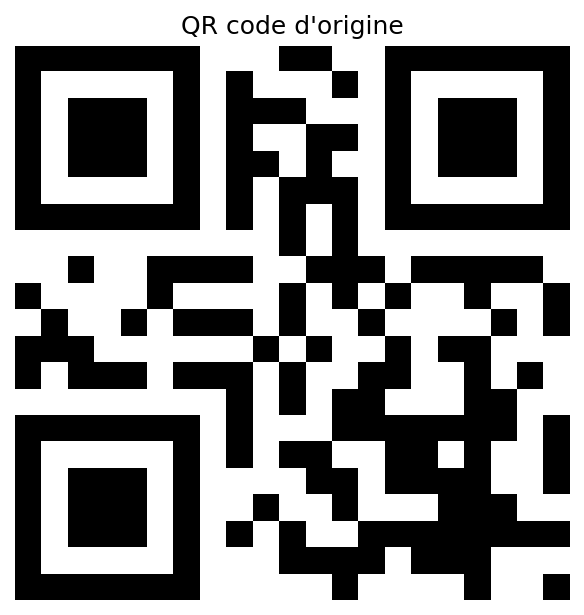
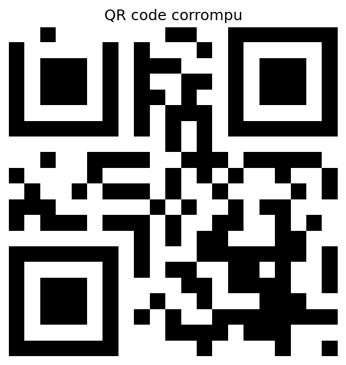

A French-language project. The code implements Reed-Solomon decoding over GF(256) for QR code error correction. 

# Génération de QR codes et décodage en cas de dégradation

Projet de TIPE réalisé en équipe de trois entre septembre 2024 et juin 2025,
en classe préparatoire MPSI-MP\* au Lycée Sainte-Geneviève.

On génère un QR code à partir d'un message, on l'encode avec un code 
de Reed-Solomon sur GF(256), on corrompt plusieurs octets, puis 
on retrouve le message d'origine par décodage via la transformée de 
Fourier.

| Original | Corrompu | Reconstruit |
|---|---|---|
| |  |  |

## Utilisation

```bash
pip install numpy matplotlib
python demo.py      # la démonstration ci-dessus
python test.py      # la suite de tests (environ 30 secondes)
```

## Principe

### Codes de Reed-Solomon

Un QR code protège ses données par un code de Reed-Solomon sur GF(256), cas particulier des codes BCH.
Les mots de code sont les multiples d'un polynôme générateur g dans $GF(256)[X]/(X^{255}-1)$.
Au niveau de correction H, g est de degré 17, ce qui permet de corriger jusqu'à 8 octets erronés.

### Décodage par la transformée de Fourier

Notons $\nu$ le nombre d'erreurs, aux positions $i_1, \dots, i_\nu$ et de valeurs $e_1, \dots, e_\nu$. Le syndrome d'indice j est la j-ième composante de la transformée de Fourier du mot reçu:

$$S_j =\sum_{l=1}^{\nu} e_l \, X_l^{\, j}, \qquad X_l = \alpha^{i_l}$$

Ces composantes ne dépendent que de l'erreur, pas du mot de code émis :
c'est ce qui permet de localiser les erreurs sans connaître le message 
d'origine. On en déduit le polynôme localisateur $\sigma$ en résolvant un système linéaire, on prolonge la transformée de Fourier de l'erreur par la récurrence associée à $\sigma$, puis on applique la transformée inverse.  
Lorsque le nombre d'erreurs est strictement inférieur  à `t`, la matrice du système est singulière. La résolution se fait donc en renvoyant une solution particulière en fixant les inconnues libres à zéro.

### Arithmétique par tables de logarithmes

GF(256)\* est cyclique d'ordre 255, engendré par $\alpha = X$. Tout élément non nul s'écrit donc $\alpha^i$ de façon unique, et $\alpha^i \cdot \alpha^j = \alpha ^{((i+j) \bmod 255)}$ : une multiplication devient une addition d'entiers. Deux tables de 255 entrées - puissances et logarithmes discrets - remplacent la multiplication polynomiale suivie d'une réduction modulaire. Le gain mesuré est d'un facteur 30 environ.

### Pourquoi la FFT radix-2 ne s'applique pas ici

Le module `fft_radix2.py` implémente un Cooley-Tukey classique, validé sur GF(17). Il n'est pas utilisé par le décodeur, et ne peut pas l'être : le radix-2 exige une racine primitive $2^k$-ième de l'unité, or GF(256)\* est d'ordre 255, impair, donc aucun de ses éléments n'a un ordre pair. 

## Limites connues

- Le paramètre `t` du décodeur doit majorer le nombre réel d'erreurs et ne pas dépasser la capacité du code. Au-delà, le décodage renvoie un mot faux sans le signaler.
- Le nombre d'erreurs est supposé connu et fourni en paramètre. Le déterminer à partir des seuls syndromes demanderait un algorithme supplémentaire, non implémenté ici. 
- Les transformées sont en $O(n^2)$ : les puissances de la racine sont précalculées, mais l'algorithme reste la définition directe.

## Organisation du code

| Fichier | Contenu | Auteur |
|---|---|---|
|`finite_field.py` | arithmétique des corps finis et des polynômes | Marius Amerdeil |
|`gf256.py` | construction de GF(256) et de l'anneau quotient | Marius Amerdeil |
|`poly_generator.py` | polynôme générateur du code | Marius Amerdeil |
|`qr_code.py` | génération du QR code à partir d'un message | Jacques Duquet |
|`fourier.py` | transformée de Fourier discrète sur un corps fini | Alexandre Bienvenüe |
|`fft_radix2.py` | FFT radix-2 sur un corps fini | Alexandre Bienvenüe |
|`decoding.py` | résolution de systèmes linéaires sur le corps (Gauss-Jordan tolérant aux systèmes singuliers) et décodage via la transformée de Fourier | Alexandre Bienvenüe |
|`demo.py`, `test.py` | démonstration et tests | Alexandre Bienvenüe |

Modifications apportées au code de mes coéquipiers lors de la fusion des versions : adaptation de la construction de l'anneau quotient dans `poly_generator.py` à la représentation des corps introduite par les tables de logarithmes, et correction de l'inverse sur les corps premiers dans `finite_field.py`.

## Tests

`test.py` vérifie l'aller-retour des transformées, la coïncidence entre la FFT radix-2 et la DFT sur GF(17) et le décodage de 0 à 8 erreurs à positions aléatoires - avec `t` égal au nombre d'erreurs comme avec `t` majorant.

## Références

[1] PANTCHICHKINE, ALEXEI : Cryptologie, Sécurité et Codage d'Information : (2004)  
[2] DEMAZURE, MICHEL : Cours d'algèbre : primalité, divisibilité, codes : (1997)  
[3] REED, IRVING STOY & SOLOMON, GUSTAVE : Polynomial codes over certain finite fields : (1960)  
[4] PEYRE, GABRIEL : L'algèbre discrète de la transformée de Fourier : niveau M1. : (2004)  
[5] THE INSTITUTE OF ELECTRICAL AND ELECTRONICS ENGINEERS : ReedSolomon Codes and Their Applications : (1994)  
[6] BAJAJ, BHAVUK SIKKA : RELIABILITY ON QR CODES AND REED-SOLOMON CODES